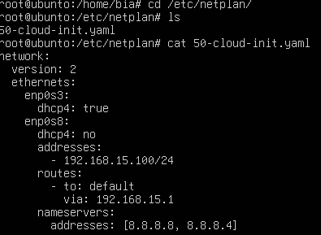
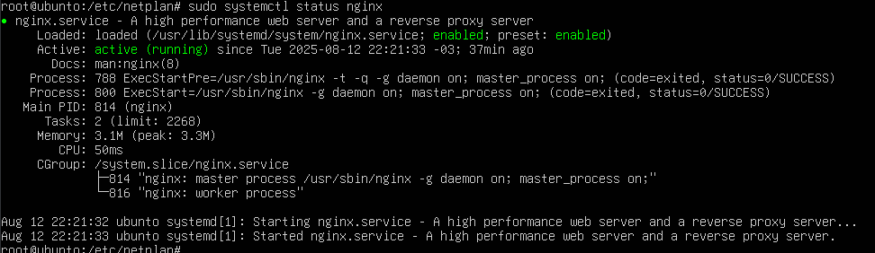
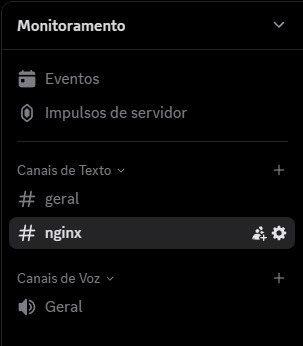
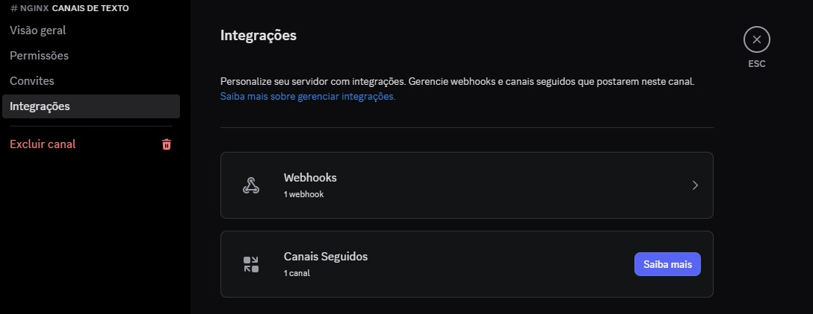
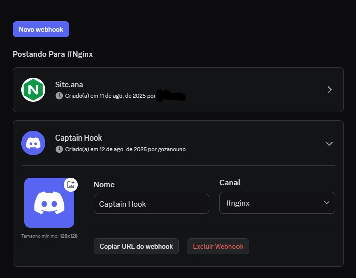
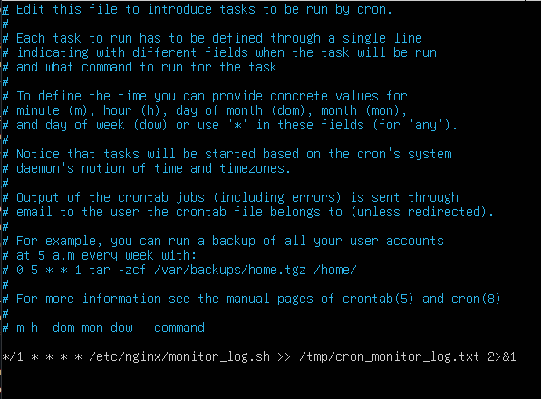
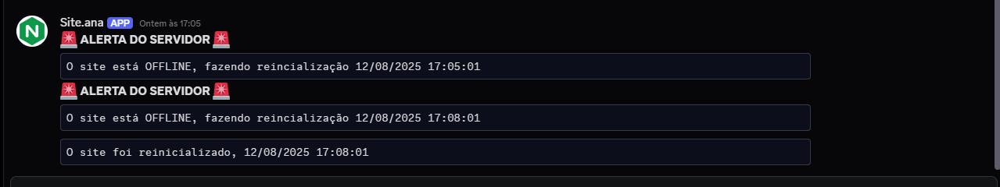

# Projeto-Service-Nginx

# 📌 Configuração de Servidor Web com Monitoramento Automático


## 🎯 Objetivo
Subir um site e configurar o monitoramento dele, recebendo alertas no **Discord** caso o servidor caia, e realizar a reinicialização automática para colocá-lo no ar novamente.

---

## 1️⃣ Instalar e Configurar o Servidor

### 1.1 Instalar e Configurar a VM
- Criar uma máquina virtual.
- Instalar o **Ubuntu Server**.
- Configurar a rede em **modo Bridge** para acesso local.
- Configuração utilizada:  


Para alterar manualmente:
```bash
cd /etc/netplan
sudo nano nome_do_arquivo.yaml
```
### 1.2 Instalar o Service Web Nginx:
- Usar o comando para executar a instalação:
```bash
sudo apt-get install nginx
```
- Verificar status do nginx com o seguinte codigo, ele deve aparecer assim:

```bash
sudo systemctl star nginx   #para inicar o nginx (codigo)
sudo systemctl status nginx   #para verficar o status 
```
-Criar o arquivo index.html no diretorio a seguir, com um html simples:
```bash
cd /var/www/html/
nano index.html
```
-Você pode acessar o site pelo eu navegar pelo http://localhost

### 1.2 Criar servidor no discord:
-Acesse o Discord e crie um servidor:


-Editar canal de texto:



-Ir em interacao e webhook:


-Criar um novo webhook, e copiar a URL:


### 2. Script de Monitoramento:
-O script de monitoramento pode ser criada na pasta de sua preferencia:
```bash
cd /etc/nginx/         #essa foi a minha
nano monitor_log.sh    #esse e o nome do arquivo de monitoramento
```
-Inserir o scrip que esta em:
[📄 Clique aqui para ver o script no repositório](https://github.com/ana-bia07/Projeto-Service-Nginx/blob/master/monitor_log.sh)

-Depois de permissão ao arquivo:
```bash
chmod +x monitor_log.sh
```
-Para testar:
```bash
sudo systemctl stop nginx
```
### 3. Verificação por Minuto:
-Com root, execute:
```bash
crontab -e
```

-Inserir a linha:
```bash
*/1 * * * * /etc/nginx/monitor_log.sh >> /tmp/cron_monitor_log.txt 2>&1
```
Explicando:
Formato do cron minuto hora dia_mes mes dia_semana assim: */1 * * * * diz pra executar a cada um minuto e * nsooutros campos diz que não importa (nao importa a hora, o dia, o mes, e o dia da semana)

```/etc/nginx/monitor_log.sh ```é o caminho absoluto do scrip

```>> tmp/cron_monitor_log.txt ``` adiciona tudo do script no final do arquivo sem apagar o que ja tem la.

```2>&1 ``` manda os erros para o mesmo arquivo.



### 4. Sucesso:
Parabéns! Se voce chegou ate aqui, tudo esta feito correto e caso aja erro, reveja o passo a passo. Pra testar execute o comando: systemctl stop nginx.
Seu Discord deve avisar assim:

